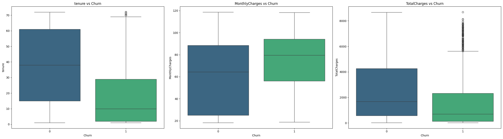

# End-to-End Machine Learning pipeline for Churn Prediction

## Overview
Presenting an end-to-end machine learning pipeline to predict customer churn. The main objective is to identify customers who are likely to stop using the services, enabling businesses to take retention actions.

💻[Predict Churn](https://end-to-end-mlops-pipeline-churn.onrender.com/)

## Dataset
Used Telco Customer Churn dataset publicly available on Kaggle ([Dataset Link](https://www.kaggle.com/datasets/blastchar/telco-customer-churn)) which includes customer demographics, account information and service usage details.
 

## Development

### EDA
- Used correlation matrix to check correlation between each variable and Churn (target variable) and it is analysed that 'tenure', 'internetService', 'Contract','PaymentMethod(Electronic_Check)' play major role in predicting if customer will leave.
- For further analysis, used box plots to check affect of numerical columns like 'tenure', 'MonthlyCharges', 'TotalCharges' and tenure and monthly charges have big impact.
- To check effect of categorical variable on target variable 'Chi-Square Test of Independence' is used, and two variables 'Gender' and 
'PhoneService' don't affect target variable (P-value > Significance level). As a result both variables were removed from the training dataset.

### Data Preprocessing
Categorical variables are transformed into numerical representations using mapping technique. Proprocessing module doesn't include any feature scaling because a tree based classifier is used. All the rows that contains NULL values is removed before model training.

### Machine Learning Classifier
Trained Random Forest Classifier to predict customer churn, and achieved > 88% accuracy on unseen test data.

## Deployment

- Created a CI/CD pipeline for auto deployment.
- Cookiecutter template is used as the project struture.
- Whole project is Dockerized for easy deployment and better portability.
- Github Actions are used for Continuous Integration after passing code analysis tests.
- Deployment is handled via Render, which is configured for automatic deployments. Every time a new commit is pushed to the GitHub repository, Render automatically builds and redeploys the application, enabling seamless Continuous Deployment.

💻You can test the project here 👉 [Predict Churn](https://end-to-end-mlops-pipeline-churn.onrender.com/)
